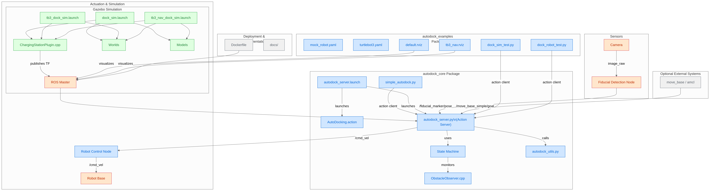

# Autonomous Docking for ROS Robots

This repository provides ROS packages designed for precise and reliable autonomous docking of differential-drive robots. Utilizing a state machine-based approach and fiducial markers for navigation, robots equipped with camera sensors can achieve accurate docking without modifying existing navigation stacks.

<div align="center">
    
  
</div>

---

## Packages

* `autodock_core`: Core docking logic and libraries
* `autodock_examples`: Demonstrations and test scripts
* `autodock_sim`: Simulation environments for docking scenarios

## Repository Workflow
<div align="center">
  
</div>

---

## Installation

Developed for **ROS Noetic**. Install dependencies first:

```bash
cd ~/catkin_ws/src
git clone https://github.com/ArghyaChatterjee/autonomous-docking-for-mobile-robots.git autodock
cd ~/catkin_ws
rosdep update && rosdep install --from-paths src --ignore-src -yr
catkin_make
```

Dependencies:

* [Fiducial Marker Detection](https://github.com/UbiquityRobotics/fiducials)
* [Turtlebot Simulation](http://wiki.ros.org/turtlebot3_simulations) (optional)

---

## Diagrams

### Architecture

<div align="center">
   
</div>

### State Machine

<div align="center">
    
</div>

---

## Running Simulations

### MockRobot Example in Gazebo

Launch Gazebo simulation:

```bash
roslaunch autodock_sim dock_sim.launch
```

Send docking goal:

```bash
rostopic pub /autodock_action/goal autodock_core/AutoDockingActionGoal {} --once
```

The robot initiates docking upon receiving a goal and interacts with a simulated charger (`MockCharger`).

Control Commands:

```bash
# Remote control robot
rosrun teleop_twist_keyboard teleop_twist_keyboard.py

# Cancel docking action
rostopic pub /autodock_action/cancel actionlib_msgs/GoalID {} --once

# Pause docking action
rostopic pub /pause_dock std_msgs/Bool True --once
```

Run smoke tests with random docking attempts:

```bash
rosrun autodock_examples dock_sim_test.py -c 10
```

---

## Turtlebot3 Docking Demonstrations

### Simple Docking

Install dependency:

```bash
sudo apt install ros-noetic-turtlebot3-gazebo
```

Launch Turtlebot3 docking:

```bash
roslaunch autodock_sim tb3_dock_sim.launch
rostopic pub /autodock_action/goal autodock_core/AutoDockingActionGoal {} --once
```

### Docking with Navigation Stack

Ensure Turtlebot3 simulation and navigation stack are installed:

```bash
sudo apt install ros-noetic-turtlebot3*
```

Run simulations:

1. Launch world and docking server:

```bash
roslaunch autodock_sim tb3_nav_dock_sim.launch
```

2. Start the navigation stack:

```bash
export TURTLEBOT3_MODEL=burger
roslaunch turtlebot3_navigation turtlebot3_navigation.launch map_file:=$HOME/map.yaml open_rviz:=0
```

3. Localize and navigate robot, then send docking goal:

```bash
rostopic pub /autodock_action/goal autodock_core/AutoDockingActionGoal {} --once
```

The system includes obstacle detection during docking.

---

## Docker Deployment

Build and run Docker container:

```bash
cd catkin_ws/src/autodock
docker build -t osrf/autodock:v1 .
docker run -it --network host osrf/autodock:v1 bash -c "$COMMAND"
```

---

### Future Work

* Improve obstacle detection integration with costmap.

---

## Debugging

Launch autodock server separately:

```bash
# Terminal 1
roslaunch autodock_sim dock_sim.launch autodock_server:=false

# Terminal 2
roslaunch autodock_core autodock_server.launch \
    autodock_config:=src/autodock/autodock_examples/configs/mock_robot.yaml
```
